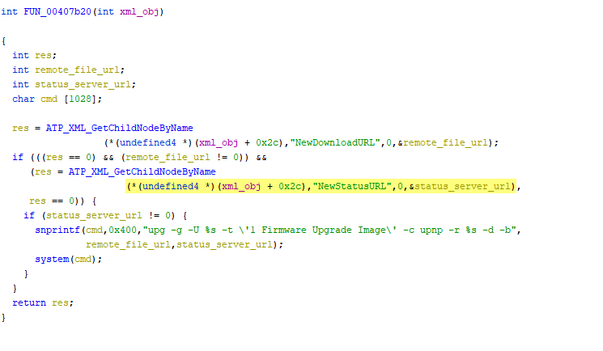
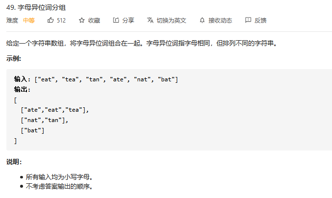

# 2020_11_6


### IoT

[Huawei HG532](https://blog.knownsec.com/2017/12/huawei-hg532-%E7%B3%BB%E5%88%97%E8%B7%AF%E7%94%B1%E5%99%A8%E8%BF%9C%E7%A8%8B%E5%91%BD%E4%BB%A4%E6%89%A7%E8%A1%8C%E6%BC%8F%E6%B4%9E%E5%88%86%E6%9E%90/)

漏洞点比较简单：



没有对用户的输入进行过滤直接拼接折后执行了`system`,主要学习一下使用`qemu-system-mode`来搭建环境。

漏洞分析目标：

1. 了解upnp协议的应用场景 （TODO）

 	2. 使用qemu尝试搭建可以与host通信的mips虚拟机  （√）
 	3. 尝试解决`user mode`无法启动upnp服务的问题   （√）
 	4. 跟踪一下漏洞利用的路径。（TODO）


## leetcode 每日一题

##### 题目link：

https://leetcode-cn.com/problems/group-anagrams/

##### 题目描述：



##### 题目思路：

先排序，然后维护一个排序后的str到group_id的map

##### code:

```cpp
class Solution {
public:

    vector<vector<string>> groupAnagrams(vector<string>& strs) {
        vector<vector<string>> res;
        int gnum = 0;
        unordered_map<string, int> us;
        for(auto s: strs){
            auto ss = s;
            sort(ss.begin(),ss.end());
            if(us.find(ss)==us.end()){
                us.insert({ss,gnum});
                vector<string> group;
                group.push_back(s);
                res.push_back(group);
                gnum++;
            }else{
                auto got = us.find(ss);
                res[got->second].push_back(s);
            }
        }
        return res;
    }
};
```


